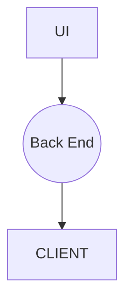

# Calendar-React-App
A calendar app we are able to schedule events, for the next days  even moths , you are able to see the other users meeting scheduled also this tool is useful for teams cause he are able to create new team members save the events on a back end 

The project allows to create a user or several with the same privacy service

Once the uer is created they'll are able to create events and all the users will see those events but won't delete or update those out

Once the event have been created the creater is able to update,delete add or new info

Basic requirements 

firebase
mongo db
react v16 or superior
react router v5 or superior
moment.js
calendar.js
redux
react-redux
redux-devtools-extension
redux-thunk

Higly recomend this frameworks been installed and extensions in order you'll see working out this app 

Basic Project Schema




REACT FOLDER STRUCTURE (TREE)
```
src
├───actions
├───auth
├───components
   ├───calendar
   ├───hooks
   └───ui.
├───helpers
├───reducers
├───router
├───store
└───types
```
